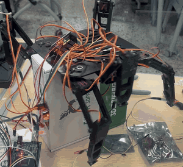
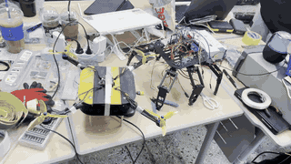
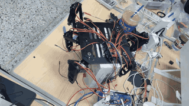
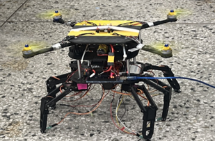
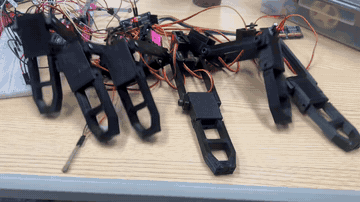
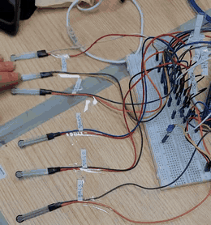

# Hexapod Drone Landing Gear

**5-person Capstone Project · Team Lead · Control Code / Sensor Integration / Integration Debugging**

드론이 평탄하지 않은 지형에서도 착륙하고, 착륙 이후 제한적으로 보행할 수 있도록 제작한 6족 랜딩기어 프로젝트입니다.

핵심 기술 과제는 **18개의 서보모터를 두 개의 PCA9685에 매핑하여 제어하고, FSR-406 입력으로 접지를 판단하며, 실제 하드웨어에서 채널·배선·기구 문제를 검증하는 것**이었습니다.

---

## Demo

| Tripod gait bench test | Uneven-ground landing |
|---|---|
|  |  |

| Ground walking | Final assembly |
|---|---|
|  |  |

| 18-servo test before assembly | FSR input test |
|---|---|
|  |  |

---

## My Contribution

- 5인 팀 프로젝트의 팀장
- Arduino Mega + PCA9685 ×2 기반 **18개 서보모터 제어 코드 작성**
- 6개 다리를 `1·3·5` / `2·4·6`으로 구분한 **Tripod gait 구동 루틴 구현**
- FSR-406 입력을 이용한 **다리별 접지 감지 및 정지 조건 제어**
- 다리별 Hip/Knee/Ankle과 PCA9685 채널 매핑 관리
- 호환 서보의 기준점 차이를 고려해 다리별 각도값 보정
- 두 번째 PCA9685에 연결된 6번 다리 미동작 문제의 채널 매핑 오류 수정
- 압력센서 연결 불량 보완
- 서보 교체·재조립 이후 배선과 채널 매핑 재검증
- 드론 결합 단계에서 배선 간섭 확인 및 개선

### Team Scope

- 6족 랜딩기어 전체 CAD 및 기구 설계는 팀 작업
- 드론 전체 제작 및 비행 제어는 팀 작업

---

## System Architecture

```text
FSR-406 × 6
    │ analog input
    ▼
Arduino Mega
    │ I2C
    ├───────────────┐
    ▼               ▼
PCA9685 #1       PCA9685 #2
0x40             0x41
15 servos        3 servos
    │               │
    └──────┬────────┘
           ▼
MG90S-class Servo × 18
6 legs × Hip / Knee / Ankle
```

| Item | Configuration |
|---|---|
| Controller | Arduino Mega |
| PWM Driver | PCA9685 × 2 |
| Actuator | MG90S-class servo × 18 |
| Pressure Sensor | FSR-406 × 6 |
| PWM Frequency | 50 Hz |
| PCA9685 Address | 0x40 / 0x41 |

---

## Control Logic

### Tripod Gait

```text
Group A = Legs 1, 3, 5
Group B = Legs 2, 4, 6

A move / B support
        ↓
A lower
        ↓
B move / A support
        ↓
B lower
        ↓
repeat
```

원본 프로젝트 코드(주석 포함 원문 그대로)에서는 각 다리의 Hip 각도를 개별 보정 배열로 관리하고, Knee/Ankle 각도를 단계별로 변경했습니다.

대표 코드: [`src/six_legged_walking.ino`](src/six_legged_walking.ino)

### FSR Landing Detection

```text
Fold leg
   ↓
Extend Knee + Ankle gradually
   ↓
Read FSR
   ↓
Threshold reached?
 ┌── No → Continue extending
 └── Yes → Stop current leg
```

단일 다리 검증 코드: [`src/one_legged_landing_gear.ino`](src/one_legged_landing_gear.ino)

---

## Key Debugging — Leg 6 Channel Mapping

### Symptom

두 번째 PCA9685 보드에 연결된 6번 다리가 정상적으로 움직이지 않았습니다.

### Isolation

1. Servo 상태 확인
2. Wiring 확인
3. PCA9685 출력 위치 확인
4. 코드 내 Servo 번호 확인
5. 실제 연결 채널과 코드 매핑 비교

### Root Cause

코드상의 서보 번호와 실제 두 번째 PCA9685 채널 연결이 일치하지 않았습니다.

### Fix

6번 다리의 Hip/Knee/Ankle을 두 번째 PCA9685의 `0 / 1 / 2` 채널로 다시 매핑했습니다.

자세한 정리: [`docs/debugging-channel-mapping.md`](docs/debugging-channel-mapping.md)

## Other Hardware Issues

| Issue | Cause | Action |
|---|---|---|
| 서보 대부분 손상 | 서보 전원에 잘못된 전압 인가 | 서보 교체·재조립, 배선과 채널 매핑 재검증 |
| 같은 각도 명령에도 다리마다 자세가 다름 | 호환 서보는 무전원 상태에서 축을 돌리면 각도 기준점이 바뀜 | 다리별 Hip 각도 배열로 보정 (코드에 40°~150°로 남아 있음) |

---

## Engineering Review

원본 코드는 실제 학부 프로젝트에서 작성한 실험·제어 코드입니다. 이후 다시 검토하면서 다음 개선점을 확인했습니다.

- `delay()` 중심의 blocking sequence → non-blocking state machine으로 개선 가능
- 각도와 채널 상수가 여러 위치에 분산 → leg configuration 구조체로 통합 가능
- 보행 주기 중 지지 다리가 불명확해지는 단계 존재 → support phase 재설계 필요
- 센서 임계값 → 개별 센서 calibration 값을 별도로 관리하는 구조가 적절

이 저장소에서는 당시 실제 구현을 과장해 다시 쓰기보다, **원본이 어떤 구조였고 현재 기준에서 무엇을 개선할 수 있는지**를 함께 보여줍니다.

---

## Source Files

| File | Purpose |
|---|---|
| [`six_legged_walking.ino`](src/six_legged_walking.ino) | 18-servo Tripod gait control |
| [`one_legged_landing_gear.ino`](src/one_legged_landing_gear.ino) | FSR threshold-based landing test |
| [`force_link_test.ino`](src/force_link_test.ino) | Basic FSR input test (LED brightness) |

공개한 코드는 프로젝트 당시 원본 그대로이며 주석도 수정하지 않았습니다. 개발 중 상태로 남아 컴파일 오류가 있는 `six_legged_landing_gear.ino`는 공개 대표 코드에서 제외했습니다.
