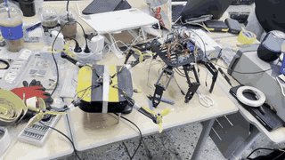
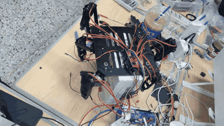
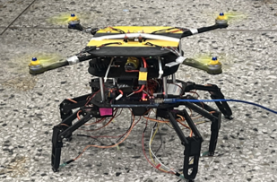
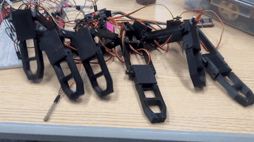
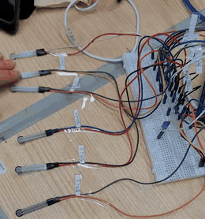

# 6족 드론 랜딩기어 (Hexapod Drone Landing Gear)

| 항목 | 내용 |
|---|---|
| 과목 | 캡스톤디자인1 (2023.09–12) |
| 팀 | 5인 — 드론 파트 / 랜딩기어 파트(2인) |
| 역할 | 팀장, 랜딩기어 파트 — 발 구조 구상, 부품 선정, 회로, 제어 코드, 센서 |
| 수상 | 2023학년도 2학기 LINC 3.0 스마트팩토링 창의대첩 창의상 (팀) |

## 1. 개요

경사·요철 지면에서도 착지할 수 있도록 드론 하부에 2-Link 다리 6개를 단 랜딩기어.
압력센서(FSR)로 다리별 접지를 감지해 하강을 멈추고, 트라이포드 보행으로 짧은 지상 이동을 하는 것이 목표.

## 2. 시연

| 트라이포드 보행 시험 (거치) | 요철 지면 다리별 착지 정지 |
|---|---|
|  |  |

| 지면 보행 | 드론 결합 |
|---|---|
|  |  |

| 조립 전 18축 서보 시험 | 압력센서 입력 시험 |
|---|---|
|  |  |

## 3. 시스템 구성

```text
압력센서(FSR) × 6
    │ 아날로그 입력
    ▼
Arduino Mega 2560
    │ I2C
    ├────────────────┐
    ▼                ▼
PCA9685 #1 (0x40)  PCA9685 #2 (0x41)
다리 1–5 (15채널)   다리 6 (3채널)
    │                │
    └──────┬─────────┘
           ▼ PWM 50 Hz
MG90S 호환 서보 × 18  (다리 6개 × Hip / Knee / Ankle)
```

| 항목 | 사양 |
|---|---|
| 제어기 | Arduino Mega 2560 (아날로그 입력 6개 필요로 Uno에서 변경) |
| PWM 드라이버 | PCA9685 × 2, I2C 주소 0x40 / 0x41 |
| 액추에이터 | MG90S 호환 서보 × 18 |
| 센서 | 압력센서(FSR) × 6 |
| PWM 주파수 | 50 Hz, 펄스폭 매핑 123–492 (4096 단위) |

## 4. 담당 범위

| 구분 | 내용 |
|---|---|
| 본인 | 착지 감지 발 구조 스케치·적용 (다리 끝 판·봉이 압력센서를 누르는 구조) |
| 본인 | 부품 선정: MG90S(크기·무게), PCA9685(가격·사양 비교) |
| 본인 | 회로 설계 (Fritzing), PCA9685 2장 주소 분리 |
| 본인 | 제어 코드: 18축 서보 제어, 트라이포드 보행 루틴, 압력 임계값 착지 정지 |
| 본인 | 시험·디버깅: 채널 매핑 대조, 압력센서 연결부 보완, 서보 교체 후 배선·채널 재확인 |
| 팀 | 다리 링크 형상(기존 설계 구조), 랜딩기어 3D 모델링, 드론 제작·비행 |

## 5. 제어 로직

### 5.1 트라이포드 보행

```text
A군 = 다리 1·3·5, B군 = 다리 2·4·6

A군 이동 / B군 지지 → A군 하강 → B군 이동 / A군 지지 → B군 하강 → 반복
```

- 다리별 Hip 각도는 보정 배열로 관리 (호환 서보의 개체별 기준점 차이 보정).
- 코드: [`src/six_legged_walking.ino`](src/six_legged_walking.ino)

### 5.2 압력센서 착지 정지

```text
다리 접기 → Knee·Ankle 단계적 전개 → FSR 읽기 → 임계값 도달 시 해당 다리 정지
```

- 정지 후 `loop()`가 처음부터 다시 실행되지 않도록 `while(1)` 대기 루프로 마지막 자세 유지.
- 코드: [`src/one_legged_landing_gear.ino`](src/one_legged_landing_gear.ino) (단일 다리 시험)

## 6. 시험 및 문제 해결

| 문제 | 확인 방법 | 원인 | 조치 |
|---|---|---|---|
| 18축 연결 후 6번 다리만 동작하지 않음 | 첫 번째 보드의 다리는 정상 → 두 번째 PCA9685만 분리해 단독 시험 | 두 번째 보드 채널과 코드의 서보 번호 매핑 불일치 | 6번 다리 Hip/Knee/Ankle을 두 번째 보드 0·1·2 채널로 재매핑 |
| 같은 각도 명령에도 다리마다 자세가 다름 | 다리별 자세 비교 | 호환 서보 개체별 기준점 차이 | 다리별 Hip 각도 배열로 보정 |

상세: [`docs/debugging-channel-mapping.md`](docs/debugging-channel-mapping.md)

## 7. 결과

- 랜딩기어 단독: 요철 지면 다리별 착지 정지, 트라이포드 전진 보행 확인.

## 8. 개선 과제 (프로젝트 이후 재검토)

- `delay()` 기반 순차 동작 → 비차단(non-blocking) 상태 기계로 변경
- 다리별 각도·채널 상수 분산 → 다리 설정 구조체로 통합
- 센서 임계값을 센서별 보정값으로 분리 관리

## 9. 파일

| 파일 | 내용 |
|---|---|
| [`src/six_legged_walking.ino`](src/six_legged_walking.ino) | 18축 트라이포드 보행 |
| [`src/one_legged_landing_gear.ino`](src/one_legged_landing_gear.ino) | 압력 임계값 착지 정지 (단일 다리) |
| [`src/force_link_test.ino`](src/force_link_test.ino) | 압력센서 입력 시험 (LED 밝기) |

- 모든 코드는 프로젝트 당시 원본이며 주석도 수정하지 않음.
- 개발 중 상태로 컴파일 오류가 있는 `six_legged_landing_gear.ino`는 제외함.
