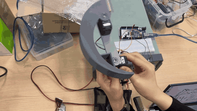
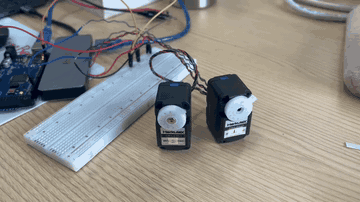
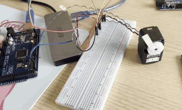
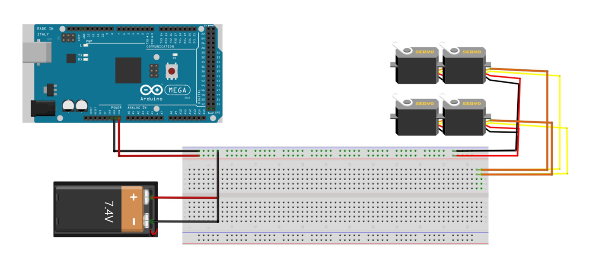
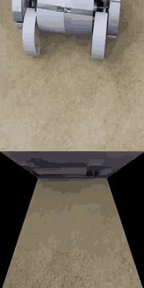
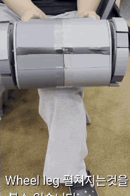
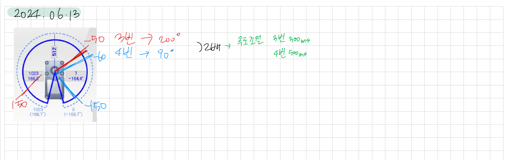

# Wheel-leg Rover

**5-person Capstone Project · Herkulex Control / Circuit Documentation / Integration Debugging**

평지에서는 원통형 바퀴로 이동하고, 장애물 환경에서는 Wheel-leg 구조와 2-Link 꼬리를 활용하도록 설계한 탐사 로봇 프로젝트입니다.

제 역할은 전체 CAD 설계가 아니라 **Herkulex DRS-0101 기반 꼬리·휠레그 서보 구동, 회로 정리, 팀 통합 코드 내 담당 명령 작성, 그리고 통합 테스트 오류 분리**였습니다.

---

## Demo

| Tail control | 2-axis tail servo test |
|---|---|
|  |  |

| Herkulex continuous rotation | Tail servo power circuit (Fritzing) |
|---|---|
|  |  |

| Team Outcome — driving | Team Outcome — wheel-leg deployed |
|---|---|
|  |  |

---

## My Contribution

- Herkulex Manager를 이용한 서보 ID 설정 및 단독 구동 확인
- 좌·우 2-Link 꼬리의 Herkulex 서보 4개 제어
- 꼬리 서보의 목표 각도와 이동 시간 설계
- `tail_movement` 계열 제어 코드 직접 작성
- 휠레그 기어 구동용 Herkulex 2개의 연속 회전 테스트 코드 작성
- 팀 통합 코드 `final.ino`에서
  - `k`: 꼬리 2개 × 2축의 돌출/복귀 명령 작성
  - `o`: Herkulex 연속 회전과 팀원 작성 DC 모터 함수를 조합한 휠레그 펼침 명령 작성
- 꼬리 서보 전원 회로 및 전체 회로도를 Fritzing으로 작성
- 통합 테스트 후 꼬리 오류의 원인 후보를 분리해 실험

### Team Scope

- Wheel-leg 전체 CAD 모델링 및 기구 설계
- Bluetooth 제어 코드
- 주행용 기어드 DC 모터 제어 함수
- Encoder 기반 위치 제어
- Linear actuator 제어
- Raspberry Pi 카메라 구현

---

## Herkulex Control Structure

```text
Arduino Mega
    │
    │ UART / Serial1, 115200 bps
    ▼
Herkulex DRS-0101
    ├─ Tail Left  : 2 servos
    ├─ Tail Right : 2 servos
    └─ Wheel-leg gear drive : 2 servos
```

Herkulex 라이브러리를 사용해 ID별 목표 각도와 이동 시간을 전달했습니다.


---

## Tail Motion

한쪽 꼬리의 두 축은 서로 다른 각도 범위와 이동 시간을 사용했습니다.

설계 메모 (연구노트, 2024.06.13):




| Servo | Position A | Position B | Move Time |
|---|---:|---:|---:|
| ID 3 | 150° | -50° | 300 ms |
| ID 4 | -150° | -60° | 500 ms |

- [`src/tail_movement_1.ino`](src/tail_movement_1.ino) — 프로젝트 당시 원본 (직접 작성). 원본에 남아 있는 `MOTOR_ID_` 오타로 이 파일 그대로는 컴파일되지 않습니다.
- [`src/tail_movement_1_cleanup.ino`](src/tail_movement_1_cleanup.ino) — 원본의 ID 오타와 미사용 변수만 정리한 사본
- [`src/inf_turn_Herkulex.ino`](src/inf_turn_Herkulex.ino) — Herkulex 연속 회전 테스트 원본 (직접 작성)

> 정리본은 프로젝트 종료 후 가독성을 위해 만든 사본입니다.

---

## Integration Contribution

팀 통합 코드에는 주행, Bluetooth, encoder, linear actuator, Herkulex가 함께 들어 있습니다.

전체 코드를 개인 코드로 공개하는 대신, 본인이 작성한 `k` / `o` 명령의 역할과 팀원 코드와의 경계를 별도 문서로 정리했습니다.

[`docs/integration-contribution.md`](docs/integration-contribution.md)

---

## Integration Debugging

### Symptom

개별 꼬리 테스트에서는 동작했지만, 전체 시스템을 하나의 코드로 통합하면 꼬리가 정상적으로 동작하지 않았습니다.

### Candidate Isolation

| Candidate | Test | Result |
|---|---|---|
| Mechanical overload | Load 제거 후 꼬리만 구동 | 오류 지속 → 배제 |
| Overheating | 전원 직후 오류 발생 여부 확인 | 배제 |
| Power | 4개 서보에 별도 power supply 공급 | 오류 지속 → 배제 |
| Communication | Mega 직결 후 2-servo / 4-servo 비교 | 2개 동작, 4개 구성에서 오류 |
| Motor fault | 추가 검증 필요 | 미확인 |
| Communication / timing interaction | 추가 검증 필요 | 미확인 |

발표 전까지 단일 원인은 확정하지 못했습니다.

이후 코드를 다시 검토하며 두 번째 꼬리 ID 3·4의 `torqueON()` 누락 가능성을 발견했지만, 이는 당시 실기기에서 재검증한 원인은 아닙니다.

자세한 내용: [`docs/integration-debugging.md`](docs/integration-debugging.md)

---

## Team-Level Mechanical Issue

휠레그 펼침용 3D 프린팅 기어는 첫 구동에서 의도대로 펼쳐졌지만, 한 번의 테스트 만에 맞물림이 밀리며 부서지고 녹았습니다. 예산과 일정상 금속 기어로 바꿀 수 없어, 기어드 DC 모터의 토크로 바퀴를 회전시켜 펼치는 방식으로 대체했고, 원형 바퀴와 휠레그를 펼친 상태 모두에서 주행을 확인했습니다.

저는 `o` 명령에서 Herkulex 연속 회전과 팀원 작성 DC 모터 함수를 함께 호출하는 통합 명령을 작성했습니다. 기어 설계와 CAD는 팀원이 담당했습니다.

---

## Engineering Takeaway

이 프로젝트에서 가장 중요한 경험은 “모든 기능이 개별적으로 동작한다”와 “전체 시스템이 통합 상태에서 동작한다”가 다르다는 점이었습니다.

통합 문제를 한 원인으로 단정하지 않고,

`Load → Heat → Power → UART → Motor State → Code Timing`

순으로 후보를 나눠 확인하는 방식으로 접근했습니다.
